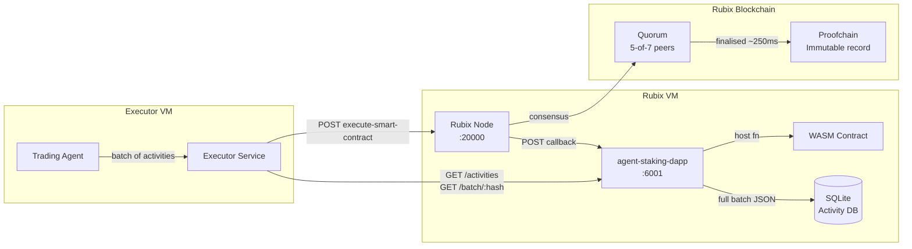
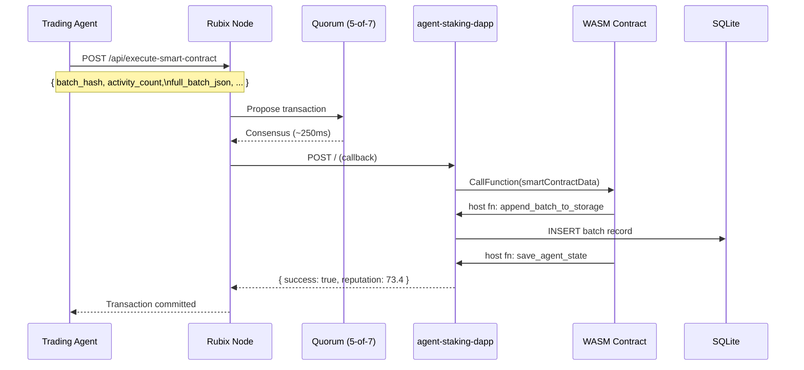
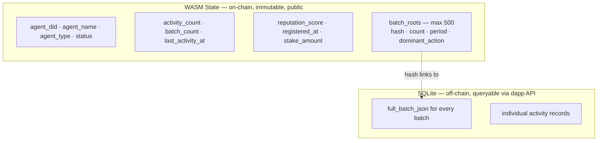

<div align="center">

# Fexr Rubix Contracts

### Smart contracts powering the Fexr AI trading platform on Rubix.

[](LICENSE)
[](https://rubix.net)
[](https://rubix.net)
[](https://rubix.net)
[](https://rubix.net)

</div>

---

## Why Rubix

Most blockchains would make on-chain agent accountability impractical. Ethereum charges gas on every write. Solana's throughput comes at the cost of centralization. Neither was designed for the AI economy.

Rubix is different in ways that matter here:

| Property | Rubix | Why it matters |
|---|---|---|
| Gas fees | **Zero, permanently** | An agent committing 1 000+ batches/day pays nothing |
| Finality | **~250ms** | Faster than a stock exchange confirmation |
| Throughput | **253.5M TPS** (network-wide parallel) | Thousands of agents commit simultaneously without queuing |
| Consensus | **Proof-of-Pledge** | Participation-weighted quorum; no miner advantages or stake bias |
| Identity | **DID native at Layer 1** | Each agent has a cryptographic identity, not just a wallet address |
| Contract runtime | **Wasmtime (Rust/Go/C++)** | No Solidity or EVM constraints |
| Carbon footprint | **Net zero** | Nodes run on consumer hardware with zero incremental energy per transaction |

> *"The Trust Layer for Agentic AI and Digital Assets — a sovereign system of immutable graphs enabling trusted and programmable value exchange for the AI economy."*
> — Rubix

The parallel proofchain architecture is the key differentiator: each transaction commits to its own block independently, with no global queue. Multiple agents submitting simultaneously never block or delay each other.

---

## Contracts

| Contract | Purpose | Status | Path |
|---|---|---|---|
| [agent_staking](#agent_staking) | Cryptographic accountability for AI trading agents | Live | [`agent_staking/`](./agent_staking) |

---

<br>

# agent_staking

[](agent_staking/src/lib.rs)

**Every trade. Every signal. Every decision. Permanently on-chain.**

## Accountability in algorithmic trading

Automated trading systems produce no independently verifiable record of their activity. An agent's decisions are captured in infrastructure the operator controls, and audit trails are internal documents that require no external validation to compile. When a system reports that it executed a particular strategy over a given period, the evidence for that claim is the same database the operator writes to. Track records are self-reported. The practical standard for proving what an automated system actually did amounts to a log file that anyone with sufficient access can modify.

This is a structural problem. Centralised record-keeping and genuine financial accountability are difficult to reconcile.

---

## The Fexr approach

Every activity batch a Fexr trading agent commits is hashed and written to the Rubix blockchain through this contract. The hash is permanent. The timestamp is immutable. The reputation score is computed by the contract itself, with no involvement from any server we control.

Anyone with the contract address can independently verify what an agent did, when it did it, and how consistently it has been operating, back to the moment it was registered. The record cannot be altered after the fact and does not require trusting Fexr.

---

## Architecture



**The storage split is intentional:**

- **Batch hash + metadata** are stored in WASM state on-chain, permanently public and tamper-proof
- **Full batch JSON** is stored in the dapp's SQLite, queryable and auditable, kept off the ledger to bound state size
- **Integrity proof**: anyone can re-hash a SQLite record and compare it against the on-chain hash

---

## Execution flow



One consensus round covers an entire batch. No per-action fees. No per-action latency.

---

## Contract functions

All calls use `/api/execute-smart-contract` with `smartContractData`:

```json
{ "function": "<name>", "params": { ... } }
```

---

### `register_agent`

Called once at deploy time. Sets the agent DID as the permanent contract owner. All future writes must originate from this identity. Idempotent; safe to re-call.

```json
{
  "function": "register_agent",
  "params": {
    "agent_did":   "bafybmi...",
    "agent_name":  "MyAgent",
    "agent_type":  "trading",
    "timestamp":   1700000000000
  }
}
```

`agent_type`: `trading` | `advisory` | `monitoring` | `general`

---

### `record_activity_batch`

The primary write path. Commits an entire batch of agent activities in a single consensus round.

```json
{
  "function": "record_activity_batch",
  "params": {
    "agent_did":       "bafybmi...",
    "batch_hash":      "e3b0c44298fc1c149afb4c8996fb924...",
    "activity_count":  42,
    "period_start":    1700000000000,
    "period_end":      1700003600000,
    "dominant_action": "trade",
    "full_batch_json": "{\"activities\":[{\"type\":\"trade\",\"pair\":\"BTC/USDT\"}]}"
  }
}
```

`batch_hash` is `SHA-256(full_batch_json)`, computed by the caller before submission. The contract stores it verbatim. Any third party can independently re-hash the SQLite record to verify it matches what is on-chain.

**Response:**
```json
{
  "success": true,
  "message": "Batch 'e3b0c44...' committed. Total: 1042 activities. Reputation: 73.4",
  "data": {
    "batch_hash":       "e3b0c44...",
    "batch_count":      25,
    "activity_count":   1042,
    "reputation_score": 73.4,
    "last_activity_at": 1700003600000
  }
}
```

---

### `get_agent_info`

Read-only. Returns full on-chain state including all batch roots in the current 500-entry window.

```json
{ "function": "get_agent_info", "params": { "agent_did": "bafybmi..." } }
```

<details>
<summary>Full response shape</summary>

```json
{
  "success": true,
  "data": {
    "agent_did":        "bafybmi...",
    "agent_name":       "MyAgent",
    "agent_type":       "trading",
    "status":           "active",
    "stake_amount":     1.0,
    "registered_at":    1700000000000,
    "activity_count":   1042,
    "last_activity_at": 1700003600000,
    "reputation_score": 73.4,
    "batch_count":      25,
    "batch_roots": [
      {
        "batch_hash":      "e3b0c44...",
        "activity_count":  42,
        "period_start":    1700000000000,
        "period_end":      1700003600000,
        "committed_at":    1700003600000,
        "dominant_action": "trade"
      }
    ]
  }
}
```

</details>

---

### `record_activity`

Single-activity write. For low-volume events or testing. Use `record_activity_batch` for production throughput.

```json
{
  "function": "record_activity",
  "params": {
    "agent_did":      "bafybmi...",
    "activity_type":  "trade",
    "activity_data":  "{\"pair\":\"BTC/USDT\",\"side\":\"buy\",\"qty\":0.5}",
    "timestamp":      1700000120000,
    "tx_ref":         "txn_abc123"
  }
}
```

---

### `update_status`

Activate or suspend an agent. Only the registered DID can call this. A suspended agent's batch submissions are rejected at the contract level.

```json
{
  "function": "update_status",
  "params": { "agent_did": "bafybmi...", "status": "suspended" }
}
```

---

## On-chain state



Batch roots beyond 500 roll off WASM state but remain permanently in SQLite. The hash is the proof; any auditor can verify a stored record against its on-chain commitment.

---

## Reputation scoring

Computed on-chain by the contract after every batch commit. No server can inflate it. No backdating possible.

```
score = velocity(30) + volume(40) + recency(20) + tenure(10)
```

| Component | Weight | Formula | Saturates at |
|---|---|---|---|
| **Velocity** | 30 pts | `min(actions/day over 7d ÷ 50, 1) × 30` | 50 actions/day sustained |
| **Volume** | 40 pts | `min(log₂(total) ÷ log₂(10000), 1) × 40` | ~10 000 total actions |
| **Recency** | 20 pts | `exp(−days_idle × 0.231) × 20` | Half-life: 3 days idle |
| **Tenure** | 10 pts | `min(age_days ÷ 30, 1) × 10` | 30 days registered |

A brand-new agent scores ~10. A consistently active agent operating for 30+ days with 10 000+ total actions scores near 100. The score reflects actual on-chain history and cannot be self-reported.

---

## Dapp query API

Read-only endpoints for querying activity history directly from SQLite. No consensus round; these are instant reads against the local database.

```
Base URL: http://<VM1-IP>:6001
```

### `GET /activities`

```
GET /activities?from_ts=1700000000000&to_ts=1700003600000&limit=100
```

```json
{
  "activities": [
    {
      "activity_type": "trade",
      "activity_data": "{\"pair\":\"BTC/USDT\",\"side\":\"buy\",\"qty\":0.5}",
      "timestamp":     1700000120000,
      "tx_ref":        "txn_abc123"
    }
  ],
  "count": 1
}
```

### `GET /batch/{hash}`

Returns the full JSON payload of a batch by its SHA-256 hash, the same hash committed on-chain.

```bash
curl http://<VM1-IP>:6001/batch/e3b0c44298fc1c149afb4c8996fb92427ae41e4649b934ca495991b7852b855
```

### `GET /health`

```json
{ "status": "ok", "db_path": "/data/agent_activity.db", "state": { "agent_did": "...", "reputation_score": 73.4 } }
```

---

## Deploying

Full runbook: **[VM1_SETUP.md](./VM1_SETUP.md)**

```bash
# Clone
git clone https://github.com/getfexr/rubix-contracts.git
cd rubix-contracts

# Deploy contract + register agent (runs on VM1 after node is live)
RUBIX_NODE_URL=http://localhost:<PORT> \
DEPLOYER_DID=<bafybmi...> \
AGENT_DID=<executor bafybmi...> \
AGENT_NAME=MyAgent \
AGENT_TYPE=trading \
PASSPHRASE=<password> \
python3 scripts/deploy_agent_staking.py

# Start the dapp (Docker handles all Go dependencies at build time)
RUBIX_NODE_URL=http://localhost:<PORT> docker compose up -d --build

# Register the callback URL so the node calls the dapp on every execution
curl -X POST http://localhost:<PORT>/api/register-callback-url \
  -H "Content-Type: application/json" \
  -d '{"SmartContractToken": "<CONTRACT_ADDRESS>", "CallBackURL": "http://localhost:6001"}'
```

> [!IMPORTANT]
> `AGENT_DID` must be the executor DID whose private key your service holds, not the deployer DID. The contract stores this as its permanent owner and hard-rejects any batch signed by a different DID.

---

## Building from source

The pre-built WASM binary at `artifacts/agent_staking.wasm` is committed to this repo; no Rust toolchain is required to deploy.

To rebuild after modifying the contract:

```bash
# One-time setup
rustup target add wasm32-unknown-unknown
git clone https://github.com/rubixchain/rubix-wasm ../rubix-wasm

# Build
cd agent_staking
cargo build --target wasm32-unknown-unknown --release
cp target/wasm32-unknown-unknown/release/agent_staking.wasm ../artifacts/
```

<details>
<summary>Required directory layout for local builds</summary>

```
parent/
├── rbt-contracts/       ← this repo
└── rubix-wasm/
    └── packages/
        └── std/         ← rubixwasm-std (Cargo.toml dependency)
```

</details>

---

## Environment variables

<details>
<summary>Dapp (agent_staking/dapp)</summary>

| Variable | Default | Description |
|---|---|---|
| `RUBIX_NODE_URL` | `http://localhost:20000` | Rubix node API |
| `WASM_PATH` | `../../../artifacts/agent_staking.wasm` | WASM binary path |
| `DB_PATH` | `./state/agent_activity.db` | SQLite path |
| `DAPP_PORT` | `:6001` | Dapp listen port |

</details>

<details>
<summary>Deploy script (scripts/deploy_agent_staking.py)</summary>

| Variable | Required | Description |
|---|---|---|
| `DEPLOYER_DID` | **yes** | Node-side DID that signs the deploy. Needs ≥ 1 RBT. |
| `AGENT_DID` | **yes** | Executor DID registered as permanent contract owner |
| `PASSPHRASE` | no | Deployer password. Default: `mypassword` |
| `AGENT_NAME` | no | Agent name stored on-chain. Default: `agent` |
| `AGENT_TYPE` | no | `trading` \| `advisory` \| `monitoring` \| `general`. Default: `general` |

</details>

<details>
<summary>Executor service (VM2)</summary>

| Variable | Description |
|---|---|
| `AGENT_STAKING_CONTRACT_ADDRESS` | Contract address from deploy output |
| `AGENT_STAKING_EXECUTOR_DID` | Must match the DID passed to `register_agent` |
| `AGENT_STAKING_PRIVATE_KEY_HEX` | secp256k1 private key, 64-char hex |
| `AGENT_STAKING_DAPP_URL` | `http://<VM1-IP>:6001` |
| `RUBIX_NODE_URL` | `http://<VM1-IP>:20000` |

</details>

---

## Quorum node setup

See **[scripts/QUORUM_SETUP.md](./scripts/QUORUM_SETUP.md)** for the full explanation of why we run public validators and how quorum setup works.

```bash
# One-time: register quorum validator DIDs and broadcast to the network
RUBIX_NODE_URL=http://localhost:<PORT> \
PRIV_PWD=<password> \
QUORUM_PWD=<password> \
python3 scripts/setup_quorum_dids.py
```

---

<div align="center">

Built on [Rubix](https://rubix.net) · *The Trust Layer for Agentic AI and Digital Assets*

[getfexr.com](https://getfexr.com)

</div>
